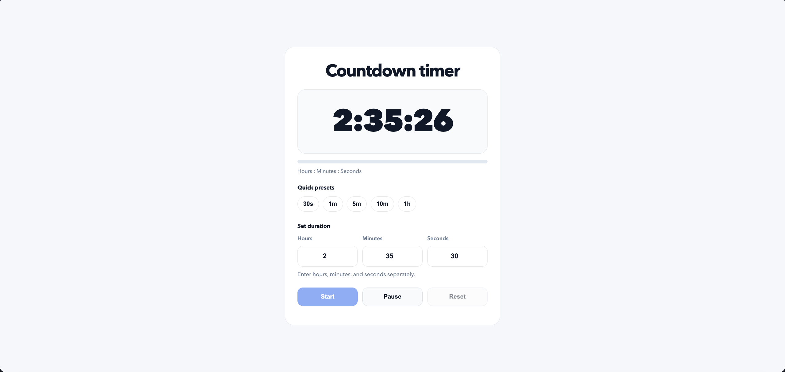

# Countdown Timer

A clean web-based countdown timer with hours, minutes, seconds, presets, pause and resume controls, and progress tracking.



## Project Structure

```text
countdown-timer/
├── index.html      # Main app markup
├── styles.css      # App styling
├── js/             # JavaScript source files
│   ├── dom.js      # DOM element references
│   ├── display.js  # Display and UI update helpers
│   ├── audio.js    # Timer completion sound
│   ├── timer.js    # Timer logic and state handling
│   └── app.js      # App startup and event listeners
├── README.md       # Project documentation
└── PROGRESS.md     # Project progress notes
```

## Run

1. Open `index.html` in a web browser.
2. Or start a simple local server from the project folder:

```bash
python3 -m http.server
```

3. Then open `http://localhost:8000` in your browser.

## Requirements

- A modern web browser
- JavaScript enabled
- No build tools or installation required

## How to Use

1. Enter hours, minutes, and seconds.
2. Or choose a quick preset.
3. Click `Start` to begin the countdown.
4. Click `Pause` to pause and `Resume` to continue.
5. Click `Reset` to return to the currently set duration.

## How It Works

- The app converts hours, minutes, and seconds into total seconds internally.
- The display updates every second.
- A progress bar fills as the countdown runs.
- When the timer finishes, the app shows a completion state and plays a sound.

## Features

- Hours, minutes, and seconds inputs
- Quick presets: `30s`, `1m`, `5m`, `10m`, `1h`
- Start, pause, resume, and reset controls
- Progress bar
- `H:MM:SS` timer display
- Keyboard shortcuts
- Completion sound
- Clean SaaS-style interface

## Limitations

- No background persistence after page reload
- Sound volume depends on browser and device settings
- The timer is designed for a single countdown at a time

## Privacy

- The app runs fully in the browser.
- No user data is sent anywhere.
- No account, login, or server is required.

## Roadmap

- Dark mode toggle
- Focus mode
- Circular progress ring
- Pomodoro mode
- More sound options

## Notes

- The timer now starts empty by default.
- The display shows hours when needed.
- Buttons and presets are handled with JavaScript event listeners.
